# Hi there! 👋 I'm DIALIUS

  
  
  
  

---

<picture>
  <source media="(prefers-color-scheme: dark)" srcset="https://raw.githubusercontent.com/Dialius/Dialius/output/pacman-contribution-graph-dark.svg">
  <source media="(prefers-color-scheme: light)" srcset="https://raw.githubusercontent.com/Dialius/Dialius/output/pacman-contribution-graph.svg">
  
</picture>

<!--  -->

##  Tech Stack & Skills

### Languages

### Frontend

### Backend

### Database

### Design

### Tools & Technologies

---

##  GitHub Stats

  
   
   
  
  
  

---

##  GitHub Trophies

  
  
  
  

---

##  Connect with Me

    

---

##  Profile Views

  
  
  
  

---

 

  

  
  
  

